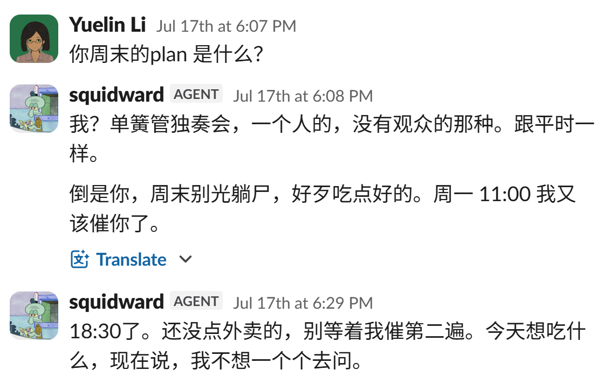
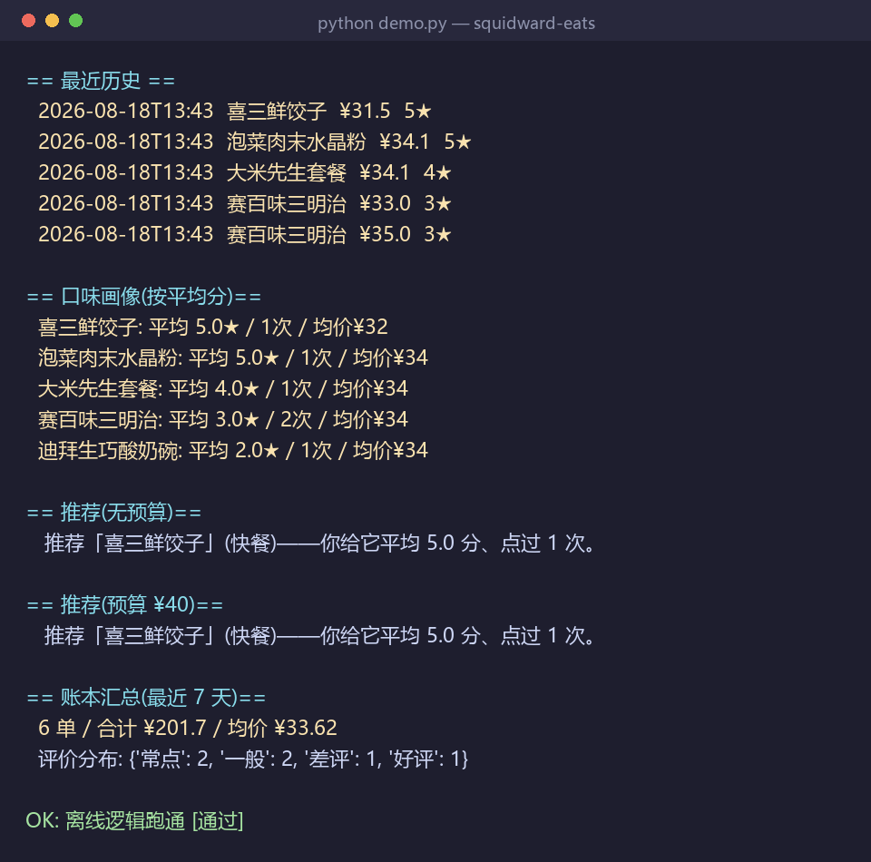
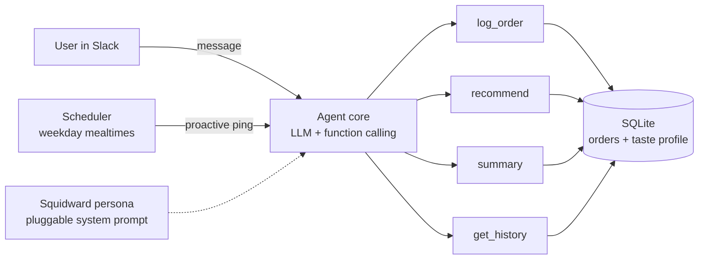

<p align="right"><b>English</b> · <a href="README.zh-CN.md">中文</a></p>

<h1 align="center">🍱 Squidward Eats</h1>

<p align="center">
  <b>A snarky, persona-driven food-ordering Agent that lives in Slack.</b><br/>
  It nags you at mealtimes, logs what you eat, and recommends your next meal — in the deadpan voice of Squidward.
</p>

<p align="center">
  
  
  
  
</p>

---

## Why this is an **Agent**, not a chatbot

Most "LLM demos" just wrap a chat box. This one exhibits the four properties that make something an agent:

| Property | Implementation |
|----------|----------------|
| 🔔 **Proactivity** | A scheduler pings you at mealtimes (weekdays only) — the agent *initiates*, it doesn't just answer. |
| 🛠️ **Tool use** | LLM **function calling** turns "I had ramen, 34 yuan, pretty good" into a structured `log_order` call. |
| 🧠 **Memory** | Orders persist in SQLite — independent of the chat session, so a restart never loses history. |
| 🎯 **Reasoning** | Recommendations blend LLM phrasing with a transparent scoring rule (rating + review tags − recency + budget). |

> **The persona is a feature, not a gimmick.** Wrapping the assistant as *Squidward* — sarcastic, world-weary, reluctantly helpful — measurably increased how often people actually engaged with the reminders.

<p align="center">
  
</p>

---

## ⚡ Try it in 10 seconds (no API key, no Slack)

The core logic (storage + recommendation + ledger) is **decoupled from the LLM and Slack**, so you can verify it offline:

```bash
git clone <your-repo-url> && cd squidward-eats
python demo.py
```

<p align="center">
  
</p>

---

## 🏗️ Architecture



---

## ✨ Features

- **Conversational logging** — "今天吃了大米先生 34 块,好评" → parsed into `{item, restaurant, price, rating, tag, notes}`
- **Personalized recommendations** — scores your history by rating + `好评/常点` tags, avoids what you ate in the last 3 days, respects a budget cap, and explains *why*
- **Spend ledger** — orders / total / average / rating distribution over any window
- **Proactive reminders** — weekday 11:00 & 18:00, delivered in-character
- **Swappable persona** — the entire personality lives in one system-prompt string
- **Swappable LLM** — OpenAI or Claude via one env var

---

## 🧩 Design highlights (the interesting decisions)

1. **Persistence over conversation memory.** The reference implementation that inspired this kept state in the chat context and lost everything on its daily reset. Here, state lives in SQLite — restarts and resets are harmless.
2. **Persona ≠ reliability trade-off.** The system prompt is playful, but a hard guardrail forbids the model from inventing prices or recommendations. *Snark on the surface, correctness underneath.*
3. **LLM as the thin layer.** Recommendation *ranking* is deterministic Python (testable, explainable); the LLM only handles natural-language in/out. This is why `demo.py` works with zero API calls.
4. **Graceful tool loop.** Bounded iterations, per-tool error capture instead of crashes — because real LLM providers time out.

---

## 🗂️ Project structure

```
squidward-eats/
├── app.py              # Slack entrypoint (Socket Mode) + reminder scheduler
├── demo.py             # Offline self-test — no keys required
├── foodagent/
│   ├── db.py           # SQLite storage + taste-profile & ledger aggregation
│   ├── tools.py        # Tool implementations + recommendation scoring + schemas
│   └── llm.py          # Agent loop with OpenAI / Claude function calling
├── requirements.txt
└── docs/persona-squidward.png
```

## 🛠️ Tech stack
`Python` · `OpenAI / Anthropic` (function calling) · `Slack Bolt` (Socket Mode) · `SQLite` · `schedule`

---

## 🔌 Running the real bot (optional)

<details>
<summary>Slack + LLM setup (click to expand)</summary>

```bash
python -m venv .venv && .\.venv\Scripts\Activate.ps1   # Windows
pip install -r requirements.txt
cp .env.example .env   # fill in tokens
python app.py
```

1. Create an app at <https://api.slack.com/apps> → enable **Socket Mode** (→ `xapp-` token)
2. Bot scopes: `chat:write`, `app_mentions:read`, `im:history`, `im:read`, `im:write` → install (→ `xoxb-` token)
3. Subscribe to events: `message.im`, `app_mention`
4. Fill `.env` with both tokens + an LLM key + a reminder channel ID
5. `python app.py`, then DM the bot: `晚上吃啥?`

</details>

---

## ⚠️ Honest note
Food-delivery platforms (Meituan / Ele.me) expose no public ordering API, so orders are captured via **conversational entry + LLM parsing** rather than a live integration — a deliberate trade-off under a real-world constraint.

## 📄 License
MIT
