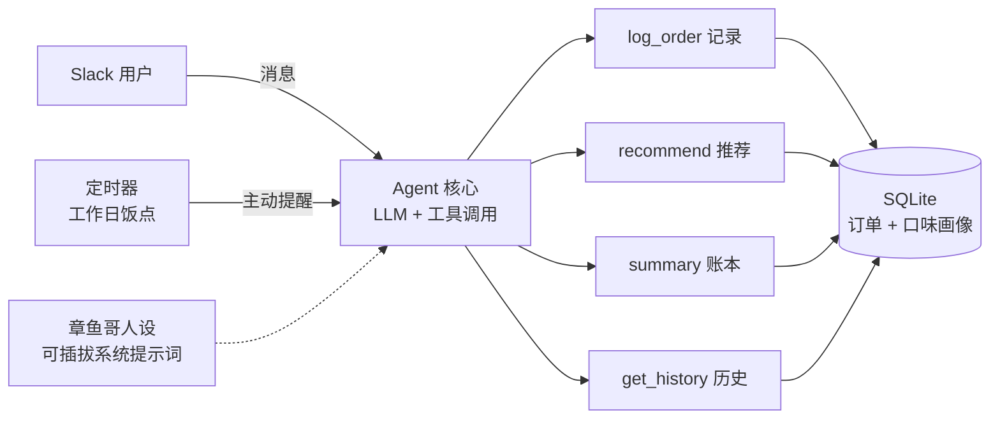

<p align="right"><a href="README.md">English</a> · <b>中文</b></p>

<h1 align="center">🍱 Squidward Eats(章鱼哥外卖助手)</h1>

<p align="center">
  <b>一个住在 Slack 里、带毒舌人设的外卖 Agent。</b><br/>
  它会在饭点催你点餐、记录你吃了什么、并推荐下一餐——全程用章鱼哥那种厌世口吻。
</p>

<p align="center">
  
  
  
  
</p>

---

## 为什么这是 **Agent**,而不是聊天机器人

大多数"LLM demo"只是包了个聊天框。这个项目具备让它成为 Agent 的四个特性:

| 特性 | 实现 |
|------|------|
| 🔔 **主动性** | 定时器在饭点(仅工作日)主动提醒——Agent 会*发起*,而非被动应答。 |
| 🛠️ **工具调用** | LLM **function calling** 把"吃了拉面,34 块,还行"转成结构化的 `log_order`。 |
| 🧠 **记忆** | 订单持久化在 SQLite,独立于对话 session——重启也不丢历史。 |
| 🎯 **推荐决策** | 推荐 = LLM 措辞 + 透明的打分规则(评分 + 好评标签 − 最近吃过 + 预算)。 |

> **人设是功能,不是噱头。** 把助手包装成*章鱼哥*(毒舌、厌世、不情愿地帮忙),明显提高了大家真正搭理提醒的频率。

<p align="center">
  
</p>

---

## ⚡ 10 秒试玩(无需 API Key、无需 Slack)

核心逻辑(存储 + 推荐 + 账本)与 LLM/Slack **完全解耦**,可离线验证:

```bash
git clone <你的仓库地址> && cd squidward-eats
python demo.py
```

<p align="center">
  
</p>

---

## 🏗️ 架构



---

## ✨ 功能

- **对话式记账** — "今天吃了大米先生 34 块,好评" → 解析成 `{菜品, 店铺, 价格, 评分, 标签, 备注}`
- **个性化推荐** — 按评分 + `好评/常点` 标签打分、避开最近 3 天吃过的、遵守预算上限,并说明*为什么*推
- **花费账本** — 任意时间窗内的餐次 / 合计 / 均价 / 评价分布
- **主动提醒** — 工作日 11:00 & 18:00,以人设口吻推送
- **可插拔人设** — 整个人格只活在一段系统提示词里
- **可切换 LLM** — 一个环境变量切换 OpenAI / Claude

---

## 🧩 设计亮点(那些有意思的取舍)

1. **持久化优于对话记忆。** 启发本项目的参考实现把状态存在对话上下文里,每天重置就全丢了。这里状态落在 SQLite,重启/重置都无害。
2. **人设 ≠ 牺牲可靠性。** 提示词很贫嘴,但有一条硬护栏禁止模型编造价格或推荐。*表面毒舌,底层严谨。*
3. **LLM 只做薄薄一层。** 推荐*排序*是确定性的 Python(可测、可解释),LLM 只负责自然语言的进出——这正是 `demo.py` 零 API 调用也能跑的原因。
4. **健壮的工具循环。** 限定轮数、逐工具捕获错误而非崩溃——因为真实 LLM 服务会超时。

---

## 🗂️ 项目结构

```
squidward-eats/
├── app.py              # Slack 入口(Socket Mode)+ 提醒定时器
├── demo.py             # 离线自测 — 无需任何 Key
├── foodagent/
│   ├── db.py           # SQLite 存储 + 口味画像 & 账本聚合
│   ├── tools.py        # 工具实现 + 推荐打分 + schema
│   └── llm.py          # OpenAI / Claude 工具调用的 Agent 循环
├── requirements.txt
└── docs/
```

## 🛠️ 技术栈
`Python` · `OpenAI / Anthropic`(function calling)· `Slack Bolt`(Socket Mode)· `SQLite` · `schedule`

---

## 🔌 运行真机器人(可选)

<details>
<summary>Slack + LLM 配置(点击展开)</summary>

```bash
python -m venv .venv && .\.venv\Scripts\Activate.ps1   # Windows
pip install -r requirements.txt
cp .env.example .env   # 填入 token
python app.py
```

1. 在 <https://api.slack.com/apps> 建 App → 开启 **Socket Mode**(得到 `xapp-` token)
2. Bot 权限:`chat:write`、`app_mentions:read`、`im:history`、`im:read`、`im:write` → 安装(得到 `xoxb-` token)
3. 订阅事件:`message.im`、`app_mention`
4. `.env` 填两个 token + 一个 LLM Key + 提醒频道 ID
5. `python app.py`,然后私聊机器人:`晚上吃啥?`

</details>

---

## ⚠️ 诚实说明
外卖平台(美团 / 饿了么)无公开点单 API,因此订单采用**对话式录入 + LLM 解析**而非实时对接——这是真实约束下的有意取舍。

## 📄 License
MIT
